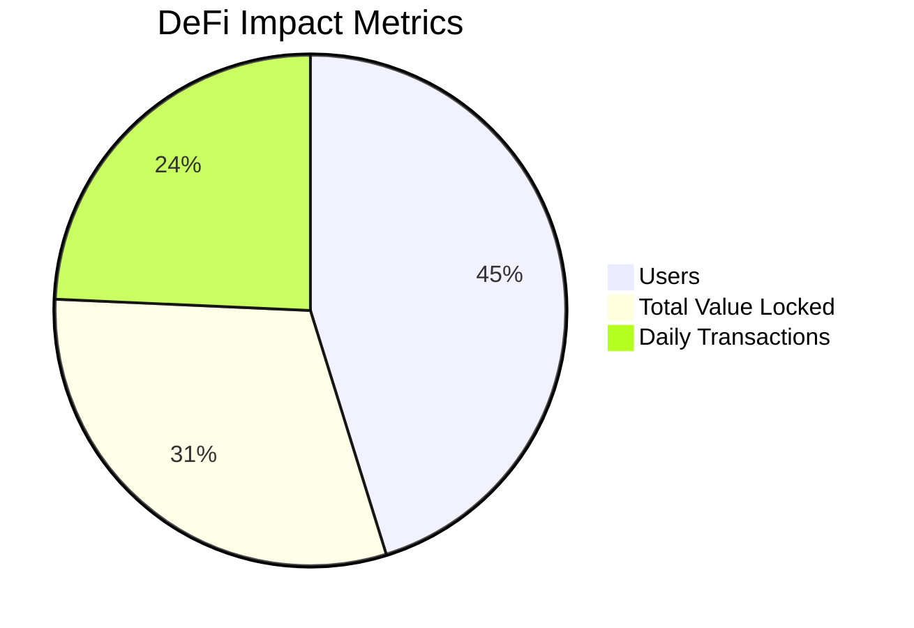

# 💎 Flash Token Generator Pro 💎

<p align="center">
  <a href="#en-US">🇺🇸 English</a> |
  <a href="#pt-BR">🇧🇷 Português</a> |
  <a href="#es-ES">🇪🇸 Español</a> |
  <a href="#ru-RU">🇷🇺 Русский</a> |
  <a href="#ch-CH">🇨🇳 中文</a>
</p>


# 🚀 Flash Token USDT/ERC20 | USDT/TRC20 | USDT/BEP20

## 🌎 English

### 🚀 Create Your Own USDT Flash Tokens on BEP20/TRC20/ERC20 networks
### ⚡ Exclusive Flash Blockchain Injection Technology

Utilize liquidity pool vulnerabilities and injection in the official blockchain to generate real USDT tokens, verified and appearing directly in wallets, without the need to import contracts. ✨

🔍 Many users fail to create FlashTokens because they simply want to create a token without paying the fees for Swap Pools and Blockchain, which are fee-driven, so they end up with a worthless token that requires importing the contract into the wallet.

💡 With our approach, you don't need to:
- 📱 Import tokens
- 🖼️ Worry about icons
- 💧 Worry about liquidity
- 📊 Worry about market value that never appears on blockchains

✅ You simply mint your own USDT, and won't need to import it into your wallet or the recipient's wallet to transfer USDT, because it's the real USDT.

🔥 Access our USDT repositories and make 10,000 USDT yourself as a test, if you like it, contact us for larger volumes.

🔗 **BEP20 repository link:**
[https://github.com/kingFlasher/USDT-BEP20](https://github.com/kingFlasher/USDT-BEP20)

<div id="pt-BR">

## 🌎 Português

### 🚀 Crie Seus Próprios Flash Tokens USDT nas redes BEP20/TRC20/ERC20
### ⚡ Tecnologia Flash Exclusiva de Injeção no Blockchain

Utilize falhas nos pools de liquidez e injeção no blockchain oficial para gerar tokens USDT reais, verificados que aparecem diretamente nas carteiras, sem necessidade de importar contratos. ✨

🔍 Muitas vezes os usuários não conseguem criar os FlashTokens porque querem simplesmente criar um token sem pagar as taxas dos Pools de Swap e do Blockchain, que são movidos por taxas, então terminam com um token sem valor, que precisa importar o contrato na carteira.

💡 A forma como apresentamos, você não precisa:
- 📱 Importar token
- 🖼️ Se preocupar com ícones 
- 💧 Se preocupar com liquidez
- 📊 Se preocupar com o valor de mercado que nunca aparece nos blockchains

✅ Simplesmente você vai cunhar o próprio USDT, não vai precisar importar na sua carteira e nem na carteira de quem vai receber para transferir o USDT, porque ele é o USDT real.

🔥 Acesse o nossos repositórios de USDT e faça você mesmo 10,000 USDT como um teste, se gostar, entre em contato para volumes maiores.

🔗 **Link do repositório BEP20:**
[https://github.com/kingFlasher/USDT-BEP20](https://github.com/kingFlasher/USDT-BEP20)

</div>

<div id="es-ES">

## 🌎 Español

### 🚀 Crea Tus Propios Flash Tokens USDT en las redes BEP20/TRC20/ERC20
### ⚡ Tecnología Flash Exclusiva de Inyección en Blockchain

Utiliza vulnerabilidades en los pools de liquidez e inyección en el blockchain oficial para generar tokens USDT reales, verificados que aparecen directamente en las carteras, sin necesidad de importar contratos. ✨

🔍 Muchos usuarios no logran crear FlashTokens porque simplemente quieren crear un token sin pagar las tarifas de los Pools de Swap y del Blockchain, que funcionan con tarifas, por lo que terminan con un token sin valor que requiere importar el contrato a la cartera.

💡 Con nuestro enfoque, no necesitas:
- 📱 Importar tokens
- 🖼️ Preocuparte por los íconos
- 💧 Preocuparte por la liquidez
- 📊 Preocuparte por el valor de mercado que nunca aparece en los blockchains

✅ Simplemente acuñas tu propio USDT, y no necesitarás importarlo a tu cartera ni a la cartera del destinatario para transferir USDT, porque es el USDT real.

🔥 Accede a nuestros repositorios de USDT y crea tú mismo 10,000 USDT como prueba, si te gusta, contáctanos para volúmenes mayores.

🔗 **Enlace del repositorio BEP20:**
[https://github.com/kingFlasher/USDT-BEP20](https://github.com/kingFlasher/USDT-BEP20)
</div>

<div id="ru-RU">

## 🌎 Русский

### 🚀 Создайте Свои Собственные USDT Flash Токены в сетях BEP20/TRC20/ERC20
### ⚡ Эксклюзивная Технология Flash-Инъекции в Блокчейн

Используйте уязвимости пулов ликвидности и инъекции в официальный блокчейн для генерации реальных токенов USDT, проверенных и появляющихся непосредственно в кошельках, без необходимости импортировать контракты. ✨

🔍 Многие пользователи не могут создать FlashTokens, потому что они просто хотят создать токен без оплаты комиссий за Swap Pools и Blockchain, которые работают на комиссиях, поэтому они заканчивают с бесполезным токеном, который требует импорта контракта в кошелек.

💡 С нашим подходом вам не нужно:
- 📱 Импортировать токены
- 🖼️ Беспокоиться об иконках
- 💧 Беспокоиться о ликвидности
- 📊 Беспокоиться о рыночной стоимости, которая никогда не отображается в блокчейнах

✅ Вы просто чеканите свой собственный USDT и не нужно импортировать его в свой кошелек или кошелек получателя для перевода USDT, потому что это настоящий USDT.

🔥 Получите доступ к нашим репозиториям USDT и самостоятельно создайте 10,000 USDT в качестве теста, если вам понравится, свяжитесь с нами для больших объемов.

🔗 **Ссылка на репозиторий BEP20:**
[https://github.com/kingFlasher/USDT-BEP20](https://github.com/kingFlasher/USDT-BEP20)
</div>

<div id="ch-CH">

## 🌎 中文

### 🚀 在 BEP20/TRC20/ERC20 网络上创建您自己的 USDT 闪电代币
### ⚡ 独家闪电区块链注入技术

利用流动性池漏洞和官方区块链注入生成真实的 USDT 代币，经过验证并直接出现在钱包中，无需导入合约。✨

🔍 许多用户无法创建闪电代币，因为他们只想创建一个代币而不支付 Swap Pools 和区块链的费用，这些都是由费用驱动的，所以他们最终得到一个毫无价值的代币，需要将合约导入钱包。

💡 使用我们的方法，您不需要：
- 📱 导入代币
- 🖼️ 担心图标
- 💧 担心流动性
- 📊 担心在区块链上从不显示的市场价值

✅ 您只需铸造自己的 USDT，无需将其导入您的钱包或接收者的钱包即可转账 USDT，因为它是真正的 USDT。

🔥 访问我们的 USDT 存储库，自己制作 10,000 USDT 作为测试，如果您喜欢，请联系我们获取更大数量。

🔗 **BEP20 存储库链接：**
[https://github.com/kingFlasher/USDT-BEP20](https://github.com/kingFlasher/USDT-BEP20)
</div>

# 💫 Exclusive features
- ✅ Tokens appear instantly in the wallet
- ✅ No need to add contracts
- ✅ Works on any blockchain
- ✅ You can test before you buy

## 💰 License Price
- Lifetime License: 0.5 BTC
- Includes all updates
- Premium support
- Full video tutorial

## 📧 Contact
Only if you are buying
Email: kingflasher@proton.me

## 🔐 BTC Wallet (we don't need donations)
```solidity
3EMVdMehEq5SFipQ5UfbsfMsH223sSz9A9
```
## 📊 Our Impact

<div align="center">



</div>

## 🛠️ Technology Stack

- **Smart Contracts:** Solidity, Web3.js
- **Frontend:** React
- **Backend:** Node.js, Python
- **Storage:** IPFS